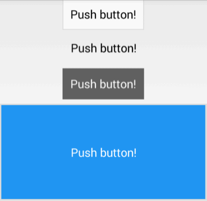

PaperStyleWidgets
=================
[](https://maven-badges.herokuapp.com/maven-central/com.annimon/paperstyle)

Widgets with material-like design for Android 2.2+

### Includes:

 * PaperButton - flat button with ripple animation.




 * PaperSeekBar - seekbar with smooth animation.


 * PaperProgressBar - horizontal progress bar (indeterminate and normal).


# Usage

### Gradle dependency

```
dependencies {
    compile 'com.annimon:paperstyle:1.1.0'
}
```

### Button

Just type `com.annimon.paperstyle.PaperButton` instead of `Button`

```xml
<com.annimon.paperstyle.PaperButton
    android:layout_width="wrap_content"
    android:layout_height="wrap_content"
    android:text="@string/button" />
```

or configure styles by add attributes

* `pw_backgroundColor` - set button background color
* `pw_focusColor` - set ripple color
* `pw_borderSize` - set button border size (0 for remove border)
* `pw_borderColor` - set border color

```xml
<com.annimon.paperstyle.PaperButton
    ...
    android:textColor="#FFFFFF"
    custom:pw_backgroundColor="#2196F3"
    custom:pw_focusColor="@color/focus"
    custom:pw_borderSize="0" />
```

or create button dynamically

```java
Button button = new PaperButton(getContext());
```

or change styles dynamically

```java
PaperButton button = new PaperButton(getContext());
button.setBackgroundColor(0xFF2196F3);
button.setFocusColor(getResources().getColor(R.color.focus));
button.setBorderColor(0x7F555555);
button.setBorderSize(convertDpToPx(2, getResources().getDisplayMetrics()));
```


### SeekBar

```xml
<com.annimon.paperstyle.PaperSeekBar
    android:max="360"
    android:layout_width="match_parent"
    android:layout_height="wrap_content"
    custom:pw_color="@color/red" />
```

Optional attribute `pw_color` changes seekbar color.

Programmatically create

```java
SeekBar seekbar = new PaperSeekBar(getContext());
```

Change style

```java
PaperSeekBar seekbar = new PaperSeekBar(getContext());
seekbar.setColor(getResources().getColor(R.color.red));
```


### ProgressBar

Indeterminate state

```xml
<com.annimon.paperstyle.PaperProgressBar
    android:indeterminate="true"
    android:layout_width="match_parent"
    android:layout_height="wrap_content" />
```

Normal state with primary and secondary progress

```xml
<com.annimon.paperstyle.PaperProgressBar
    android:progress="0"
    android:secondaryProgress="180"
    android:max="360"
    android:layout_width="match_parent"
    android:layout_height="wrap_content"
    custom:pw_progressColor="#9C27B0"
    custom:pw_secondaryProgressColor="#779C27B0" />
```

* `pw_progressColor` - set primary progressbar color
* `pw_secondaryProgressColor` - set secondary progressbar color (if needed)

Create dynamically

```java
ProgressBar progressbar = new PaperProgressBar(getContext());
```

Change style dynamically

```java
PaperProgressBar progressbar = new PaperProgressBar(getContext());
progressBar.setProgressColor(0xFF9C27B0);
progressbar.setSecondaryProgressColor(0x779C27B0);
```
